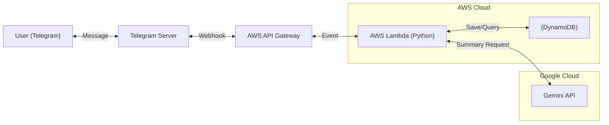

# Telegram Chat Summarizer Bot (v1.0)

      

> **"대화 30개가 300개처럼 느껴지는 바쁜 당신을 위해."**
>> 텔레그램 그룹 채팅방의 대화를 놓쳐도 걱정하지 마세요. AI가 핵심만 요약해 드립니다.


## 📖프로젝트 소개 (Introduction)

이 텔레그램 요약 봇은 카카오톡(KakaoTalk)의 요약 기능에서 영감을 받아, 텔레그램에서 누구나 쉽게 대화의 맥락을 파악할 수 있도록 돕는 봇을 개발했습니다.

서버리스(Serverless) 아키텍처를 채택하여, 24시간 서버를 켜둘 필요없이, 메시지가 올 때만 작동하여 유지비를 최소화하였습니다.

_[작동 영상 추가 예정]_

## ✨ 주요 기능 (Features)

- 실시간 대화 저장: 텔레그램의 웹훅을 통해 대화내용이 안전하게 저장됩니다. 저장된 메시지는 7일뒤에 자동으로 삭제됩니다.(TTL)
- AI 요약: /명령으로, 최근 대화 내용을 Google의 인공지능, Gemini가 분석하여 요약합니다.
- UI/UX: 대기 메시지 및 에러 발생 시 사용자 알림 기능을 제공함.
- AWS Lambda의 서버리스 프리티어와 gemini api를 통해서 유지비용 최소화


## 🏗 아키텍처 (Architecture)

- **AWS Serverless Architecture (Event-Driven)**


1.  **AWS API Gateway**: 텔레그램 웹훅 요청을 수신하는 단일 진입점.
2.  **AWS Lambda(Python)**:
      * **`Router`**: '일반 대화'인지 '명령어'인지 판단.
      * **`Recorder`**: 일반 대화는 DynamoDB에 비동기 저장.
      * **`Summarizer`**: 명령어 수신 시 DynamoDB 조회 후 Gemini API 호출.
3.  **Amazon DynamoDB**: 대화 로그를 저장하는 NoSQL 데이터베이스 (Partition Key: `chat_id` / Sort Key: `timestamp`)
4.  **Google Gemini API**: 대화 내용을 분석하고 요약문을 생성하는 LLM 엔진.


## 🛠 기술 스택 (Tech Stack)

- **Language**: Python 3.10
- **Framework**: AWS SAM (Serverless Application Model)
- **Infrastructure**: AWS Lambda, API Gateway, DynamoDB
- **AI Model**: Google Gemini-2.5-Flash-Lite (Cost-Effective)
- **Library**: `python-telegram-bot` (Async), `boto3`, `google-generativeai`


## 💡 핵심 기술 및 설계 (Key Engineering Patterns)

본 프로젝트는 안정적인 서비스 운영을 위해 다음과 같은 엔지니어링 패턴을 적용했습니다.

- **멱등성(Idempotency) 보장**:
    - 네트워크 지연이나 AI 처리 시간 초과로 인해 텔레그램 서버가 요청을 재전송(Retry)하는 경우, 중복 응답이 발생할 수 있습니다.
    - 이를 방지하기 위해 **DynamoDB의 조건부 쓰기(Conditional Write)**를 활용하여, 이미 처리 중인 `update_id`가 들어오면 작업을 수행하지 않고 즉시 종료하는 로직을 구현했습니다.
- **비동기 파이프라인 최적화**:
    - AWS Lambda의 동기적 핸들러(Sync)와 Python 라이브러리의 비동기(Async) 특성을 효율적으로 연결하기 위해 `asyncio` 브릿지 패턴을 적용했습니다.
    - 봇 객체의 세션 수명 주기를 명확히 관리하여 `Event loop is closed`와 같은 런타임 오류를 방지했습니다.


## 🚀 설치 및 배포 (Deployment)

이 프로젝트는 **AWS SAM CLI**를 사용하여 배포됩니다.

### 1. 사전 준비 (Prerequisites)

- AWS 계정 및 CLI 설정 (`aws configure`)
- SAM CLI, Python 3.10+, Poetry 설치
- Telegram Bot Token 및 Google Gemini API Key 발급

### 2. 설치
```shell
git clone [repository-url]
cd telegram-summarizer-bot
poetry install
```

### 3. 배포
```shell
# 의존성 파일 생성
poetry export -f requirements.txt --output src/requirements.txt --without-hashes

# AWS SAM 빌드 및 배포
sam build
sam deploy --guided
```
_(배포 과정에서 API Key 등을 입력받습니다.)_

### 4. 웹훅 연결 (Webhook Setup)
배포가 완료되면 Outputs에 출력된 URL을 사용하여 텔레그램과 봇을 연결해야 합니다.

```shell
# [TOKEN]과 [API_GATEWAY_URL]을 본인의 것으로 변경하여 터미널에서 실행.
# 주의: []는 제외하고 입력.
curl -X POST "https://api.telegram.org/bot[TOKEN]/setWebhook?url=[API_GATEWAY_URL]&drop_pending_updates=true"
```

***

## 📅 로드맵 (Roadmap)
- [x] v1.0: 기본 요약 기능 및 DB 연동 완료
- [ ] _기능 추가 검토중_
